# Wattson Fence Placement Diagrams

These diagrams illustrate standard and advanced fence placement techniques for effective area denial.

## 1. The "Triangle" Door Defense
**Purpose:** Maximum coverage against door pushes. If an enemy breaks the door, they must cross a fence line to enter.
**Why:** A single line across a door is easily destroyed from the outside. A triangle forces them to expose themselves to shoot the side nodes.
**Nodes:** 3

**Placement:**
- **Node 1 & 3:** Place wide on either side of the door frame, tucked behind the wall so they cannot be shot from outside.
- **Node 2:** Place further back into the room, forming the tip of the triangle.

---

## 2. The "Hourglass" / X-Pattern
**Purpose:** Hallway or choke point lockdown. Creates a "kill box" that is difficult to traverse without taking multiple ticks of damage.
**Why:** Crossing the center point guarantees a slow + damage.
**Nodes:** 4

**Placement:**
- Place 4 nodes in a rectangle.
- Connect diagonally (Top-Left to Bottom-Right, Top-Right to Bottom-Left).
- Creates an intersection point that is very hard to move through quickly.

---

## 3. End-Game Zone Control
**Purpose:** Holding a small final ring area in the open or partial cover.
**Why:** Balances perimeter defense with grenade protection.
**Nodes:** 6-12 (Max Usage)

```mermaid
graph TD
    subgraph Zone[Defensive Zone]
    direction BT
    style Zone fill:#2a2a2a,stroke:#0f0,stroke-width:1px,stroke-dasharray: 5 5
    
    Pylon{{⚡ PYLON ⚡}}
    Team((Team))
    
    Cover[Hard Cover]
    
    %% Fence Arc
    N1(( )) === N2(( ))
    N2 === N3(( ))
    N3 === N4(( ))
    N4 === N5(( ))
    
    classDef node fill:#444,stroke:#0ff,stroke-width:2px;
    class N1,N2,N3,N4,N5 node;
    
    style Pylon fill:#44f,stroke:#fff,stroke-width:3px,color:#fff
    style Team fill:#0a0,stroke:#0f0,color:#fff
    style Cover fill:#555,stroke:#000
    
    linkStyle 0,1,2,3 stroke:#0ff,stroke-width:4px
    
    end
    
    Team --> Cover
    Pylon --> Cover
    
    Enemy1[Push Angle A] -.->|LOS| N1
    Enemy2[Push Angle B] -.->|LOS| N5
    
    style Enemy1 fill:#a00,stroke:#f00,color:#fff
    style Enemy2 fill:#a00,stroke:#f00,color:#fff
```

**Strategy:**
1.  **Cover First:** Identify the one piece of hard cover (rock, truck, box).
2.  **Pylon Tuck:** Place Pylon immediately *behind* that cover, opposite to the enemy threat.
3.  **Perimeter:** Fan fences out in a wide arc *around* your cover, ensuring no enemy can simply walk up to your rock without crossing a fence.
4.  **Team:** Play tight to the Pylon for passive shield regen.

---
**Note:** Pylon destroys all incoming ordnance. Ensure line-of-sight from Pylon to incoming grenade trajectories is clear, but Pylon itself is hidden from gunshots.

---

## 4. The "Zip-line Trap"
**Purpose:** Punishing players taking vertical or horizontal zips.
**Why:** Enemies on zip-lines have predictable trajectories and cannot shoot accurately.
**Nodes:** 2-4

**Placement:**
- **Vertical Zips:** Place the fence *across* the floor where they must hop off.
- **Horizontal Zips:** Place the nodes in a 'V' shape at the end of the line so they fly into it.

---

## 5. The "Portal Cross" (Wraith Counter)
**Purpose:** Locking down an enemy Wraith portal.
**Why:** Enemies exiting a portal are disoriented and cannot see the fence until it's too late.
**Nodes:** 2

```mermaid
graph TD
    subgraph PortalTrap[Portal Exit]
    style PortalTrap fill:#1a0526,stroke:#a0f,stroke-width:2px
    
    Portal((🌀 PORTAL))
    N1((Node 1))
    N2((Node 2))
    
    %% The Fence intersects the portal
    N1 ===|Stun| Portal
    Portal ===|Damage| N2
    N1 === N2
    
    classDef node fill:#444,stroke:#0ff,stroke-width:2px;
    class N1,N2 node;
    
    style Portal fill:#50a,stroke:#f0f,stroke-width:4px,color:#fff
    
    linkStyle 0,1,2 stroke:#0ff,stroke-width:4px
    
    end
    
    Enemy[Enemy Team] ==>|Takes Portal| Portal
    style Enemy fill:#a00,stroke:#f00,color:#fff
```

**Strategy:**
- Place one node on either side of the portal.
- Ensure the connection line passes directly *through* the center of the portal.
